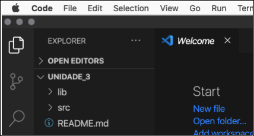
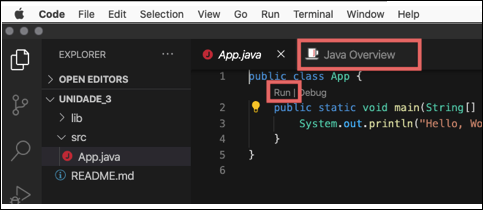

<!-- [x]TODO:INICIO atualizar -->  
[JavaDownLoad]: <https://adoptium.net/> "JavaDownLoad"  
[VSCodeDownLoad]: <https://code.visualstudio.com/> "Para instalar o VSCode"

# Disciplina de Introdução à Programação

## Ambiente de Desenvolvimento Prático

Para o desenvolvimento da parte prática precisamos de uma **Linguagem de Programação** e uma **IDE** (Integrated Development Environment ou Ambiente de Desenvolvimento Integrado). Também podemos usar outras ferramentas para ajudar neste processo de aprender a programar. Separei algumas abaixo que gradativamente iremos usar. Bom, vamos começar pela Linguagem de Programação (_let's go_).

### Instalando a Linguagem de Programação - Java

Para instalar o Java acesse o link

[JavaDownLoad].  

Selecionar Temurin 11 (LTS) ou uma versão mais recente. Clique no Último Lançamento, e assim irá baixar um arquivo .msi. Depois dê dois clicks no arquivo, … e alguns next … mas ATENÇÃO … se aparecer uma janela deste tipo

selecione a opção em vermelho. Assim a variável do sistema JAVA_HOME fica definida para está instalação do Java … e depois, next, ..., finish.

### Instalando a IDE - VSCode

A IDE a ser utilizada será o Microsoft Visual Studio Code (VSCode). Além do VSCode também será necessário instalar algumas **Extensions** (extensões) para trabalhar com a linguagem de programação definida (no caso o Java).

#### Instalando o VSCode

Para instalar o VSCode acesse o link

[VSCodeDownLoad].

Selecione Versão para Windows – Stable Build. Dois clicks no arquivo, e next, ..., next, finish.

#### Instalando as Extensions

A instalação das extensões é feita direto dentro do VSCode. Para isto, abra o VSCode, é vá para barra lateral “Extensions”. No campo de texto que aparecer digite: java, e na primeira ocorrência de “Java Extension Pack” clicar em install.

Ao instalar a extensão “Java Extension Pack” outras extensões devem ser instaladas outras extensões junto, e no final deve ter estas extensões:

  

**Importante**: feche e abra o VSCode para efetivar as instalações das extensões.

### Testando o Ambiente de Desenvolvimento

Uma maneira prática de testar o ambiente que iremos usar é criando um "Hello World" em Java. Para fazer este teste existe várias formas, uma delas é:

- No VSCode no menu "View / Command Palette …" digite/selecione "Java:  Create Java Project …".
  
  

- Selecione "No build tools" … espere um pouco … e quando aparecer a janela escolha um "local" para salvar o seu projeto. Após selecionar o "local" entre com um nome para seu projeto, e pressione "enter" para confirmar. O seu projeto deve ter sido criado, e aparecer algo deste tipo:  
  

- Agora selecione na janela esquerda do VSCode a pasta "src", e depois o arquivo "App.java". As vezes além de abrir a janela para mostrar o arquivo "App.java" também abre a janela "Java Overview" .. por enquanto podes fechar a janela "Java Overview".
  

- Agora clique em "Run" que aparece no texto da janela "App.java" entre as linhas 1 e 2. Assim deve aparecer uma nova janela abaixo da janela do texto do "App.java" com algumas linhas de texto .. é a janela do "TERMINAL". Nesta janela (do TERMINAL) deve aparecer o texto "Hello, World!".

- este texto é a mensagem que foi definida no programa "App.java" para ser escrito para o usuário … e … meus parabéns, já tens o PRIMEIRO programa em Java 😉.

## VSCode Inlay Hints

[VSCode: Inlay hints](vscodeInlayHints.md)  

## Ambiente de Desenvolvimento Versão Web

[https://vscode.dev/](<https://vscode.dev/>)  

Também existe a opção de usar o VSCode usando um Navegador Web (Browser), mas aconselho a só usar como um "plano B". Acredito que a opção [IDE Desktop](#ambiente-de-desenvolvimento-pr%C3%A1tico) seja mais indicada.  

## AI Tools in VS Code  

E por fim, mas não menos importante de se comentar o uso ou não de "facilitadores" para auto-completar códigos. Bom, exitem muitas opções, e pensando assim será que ainda precisaria "**perder**" tempo aprendendo a programar.  

É algo para se pensar ... e cuidem com o "Dilema do Exterminador do Futuro".  

Vejam, toda tecnologia (ferramenta etc.) que possa auxiliar o processo de desenvolvimento sempre é bem vinda. Até mesmo porque senão estaríamos agora programando usando "catões perfurados".  

É uma conversa longa que explicarei melhor em aula ... mas basicamente a disciplina de Introdução à Programação não é só para gerar programas, mas sim exercitar todo o processo lógico necessário para o Pensamento Computacional.  
Lembrem, se fossem assim, não se precisaria mais ensinar matemática pois com certeza os computadores fazem (ou farão a curto prazo) contas melhores que os humanos.  

VSCode: <https://code.visualstudio.com/docs/editor/artificial-intelligence>  
GitHub Copilot extension: <https://marketplace.visualstudio.com/items?itemName=GitHub.copilot>  
